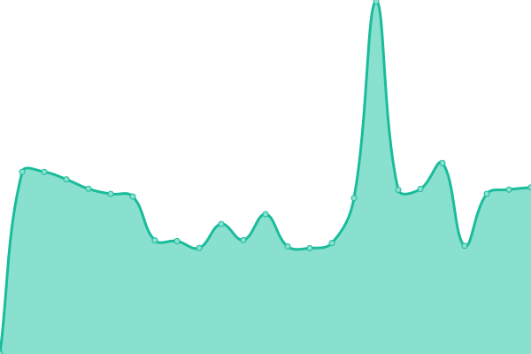

# [📈 Live Status](https://status.henrikdev.xyz): <!--live status--> **🟧 Partial outage**

This repository contains the open-source uptime monitor and status page for [Henrik Mertens](https://docs.henrikdev.xyz), powered by [Upptime](https://github.com/upptime/upptime).

With [Upptime](https://upptime.js.org), you can get your own unlimited and free uptime monitor and status page, powered entirely by a GitHub repository. We use [Issues](https://github.com/Henrik-3/api-status/issues) as incident reports, [Actions](https://github.com/Henrik-3/api-status/actions) as uptime monitors, and [Pages](https://status.henrikdev.xyz) for the status page.

<!--start: status pages-->
<!-- This summary is generated by Upptime (https://github.com/upptime/upptime) -->
<!-- Do not edit this manually, your changes will be overwritten -->
<!-- prettier-ignore -->
| URL | Status | History | Response Time | Uptime |
| --- | ------ | ------- | ------------- | ------ |
|  [VALORANT Ingame API](https://api.henrikdev.xyz/valorant/v1/by-puuid/mmr/eu/54942ced-1967-5f66-8a16-1e0dae875641) | 🟥 Down | [valorant-ingame-api.yml](https://github.com/Henrik-3/api-status/commits/HEAD/history/valorant-ingame-api.yml) | 

 3503ms
     
 | 

<a href="https://status.henrikdev.xyz/history/valorant-ingame-api">98.10%</a>
    

|  [General API](https://api.henrikdev.xyz/main/status) | 🟩 Up | [general-api.yml](https://github.com/Henrik-3/api-status/commits/HEAD/history/general-api.yml) | 

 422ms
     
 | 

<a href="https://status.henrikdev.xyz/history/general-api">100.00%</a>
    

<!--end: status pages-->

[**Visit our status website →**](https://status.henrikdev.xyz)

## 📄 License

- Powered by: [Upptime](https://github.com/upptime/upptime)
- Code: [MIT](./LICENSE) © [Henrik Mertens](https://docs.henrikdev.xyz)
- Data in the `./history` directory: [Open Database License](https://opendatacommons.org/licenses/odbl/1-0/)
